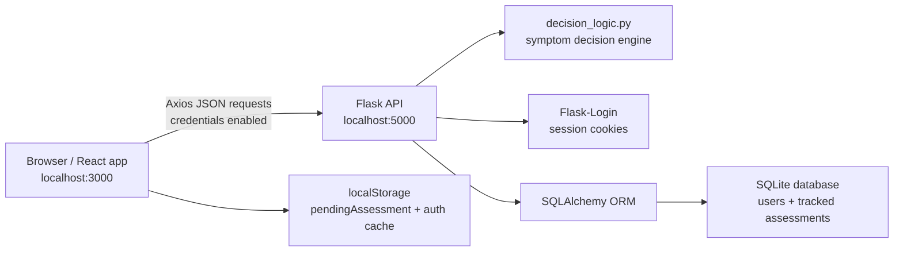
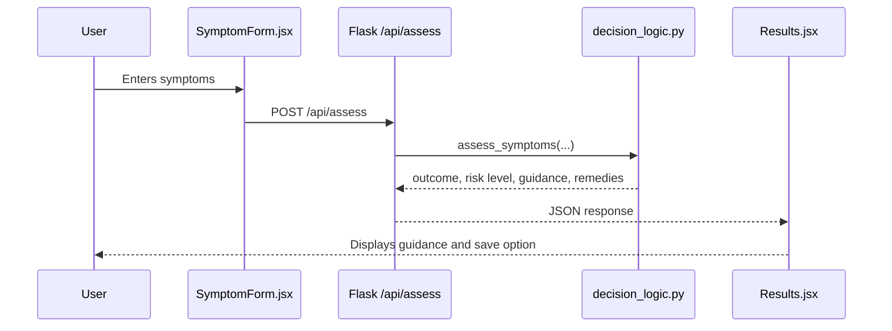
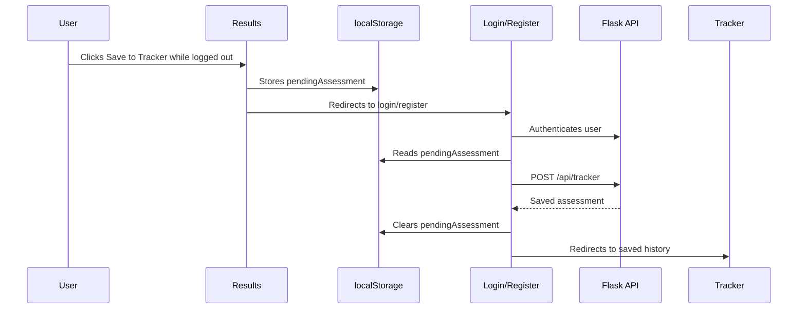
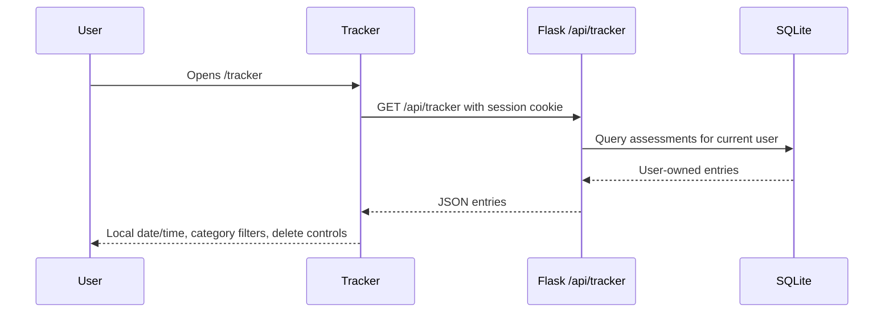

# Pneumtofy Architecture and Data Flow

This document describes the current website architecture as of May 6, 2026.

## System Overview

Pneumtofy is a local React and Flask application with a session-based authentication layer and a SQLite-backed tracker.

## Frontend Architecture

The frontend is a React single-page application.

| Area | Files | Responsibility |
|------|-------|----------------|
| Routing | `frontend/src/App.jsx` | Defines page routes and full-width layout behavior |
| Navigation | `frontend/src/components/Navigation.jsx`, `frontend/src/styles/Navigation.css` | Desktop nav, mobile hamburger menu, auth actions |
| Auth state | `frontend/src/contexts/AuthContext.jsx` | Current user, login/logout/update methods, auth loading state |
| Assessment form | `frontend/src/components/SymptomForm.jsx` | Collects symptoms and sends them to the backend |
| Results | `frontend/src/components/Results.jsx` | Shows outcome guidance and handles save-to-tracker |
| Tracker | `frontend/src/components/Tracker.jsx` | Protected saved assessment history and current filters |
| Info Hub | `frontend/src/components/Info.jsx`, `frontend/src/styles/Info.css` | Full-width educational article page |
| Dates | `frontend/src/utils/dateFormatter.js` | Converts timestamps into local browser date/time |

The app uses React Router routes for:
- `/`: Home and assessment entry
- `/results`: Assessment result page
- `/info`: Health Information Hub
- `/tracker`: Protected tracker page
- `/login`: Login
- `/register`: Registration

## Backend Architecture

The backend is a Flask API.

| File | Responsibility |
|------|----------------|
| `backend/app.py` | App setup, CORS, auth routes, assessment route, tracker routes |
| `backend/decision_logic.py` | Current symptom decision logic and guidance generation |
| `backend/database.py` | SQLAlchemy initialization |
| `backend/models_auth.py` | `User` and `TrackedAssessment` models |
| `backend/models.py` | Supporting/legacy information model code |

## Main Data Flows

### Assessment Flow

### Guest Save to Tracker Flow

### Tracker Flow

## Current Decision Logic

The backend currently classifies assessments into four outcomes.

| Logic path | Returned assessment | Risk level |
|------------|---------------------|------------|
| Any danger sign | `SEEK IMMEDIATE MEDICAL CARE` | `CRITICAL` |
| Cough plus age-based fast breathing | `PNEUMONIA - Treat with Amoxicillin` | `MODERATE` |
| Cough/cold without danger signs or fast breathing | `SIMPLE COUGH or COLD` | `MILD` |
| Mild symptoms without pneumonia signs | `OBSERVE & MANAGE AT HOME` | `MILD` |

Danger signs include chest indrawing, dyspnea/difficulty breathing, stridor, lethargy, unable to drink, convulsions, cyanosis, and unconsciousness.

Fast breathing thresholds:
- 2 to under 12 months: 50 breaths/min or more
- 12 to under 60 months: 40 breaths/min or more

## Tracker Categories

The tracker maps saved assessment text into filter categories:
- `urgent`: seek immediate care / critical
- `pneumonia`: pneumonia, amoxicillin, or moderate
- `simple-cough`: simple cough or cold
- `observe`: observe/manage or mild
- `other`: fallback for unrecognized legacy entries

## Data Model

### User

Stores login and profile data:
- username
- email
- password hash
- guardian name
- phone
- timestamps and login metadata

### TrackedAssessment

Stores saved symptom data and result data for one user:
- `user_id`
- symptom fields such as age, cough duration, fever, breathing signs, and danger signs
- `assessment`
- `recommendation`
- `guidance`
- `home_remedies`
- timestamp

## Local Network Note

Local desktop development works with `localhost` for both servers. Phone testing through a LAN IP needs extra configuration because a phone treats `localhost` as the phone itself. The backend must listen on the LAN interface and the frontend API URL must point to the computer's LAN IP.

## Build Note

`npm run build` writes optimized static output to `frontend/build`. It does not rewrite source `.jsx` or `.css` files.
