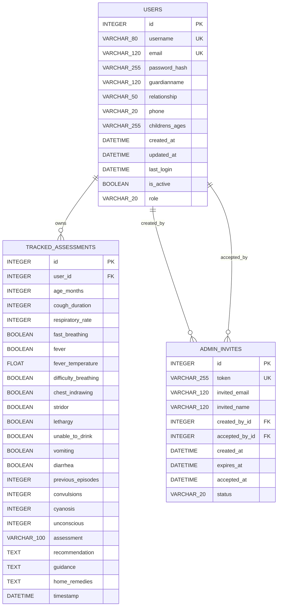

# Pneumtofy SQLite ER Diagram

Source database: `backend/instance/pneumtofy.db`

## Relationship Summary

| Parent table | Child table | Foreign key | Meaning |
|---|---|---|---|
| `users` | `tracked_assessments` | `tracked_assessments.user_id -> users.id` | A user can own many saved symptom assessments. |
| `users` | `admin_invites` | `admin_invites.created_by_id -> users.id` | An admin user can create many admin invitations. |
| `users` | `admin_invites` | `admin_invites.accepted_by_id -> users.id` | A user/admin account can be linked to an accepted invitation. |

## Notes From The Actual SQLite Database

- The database currently has `users`, `tracked_assessments`, and `admin_invites`.
- `tracked_assessments` is linked to `users`, so tracker records are user-specific.
- `admin_invites` has two links back to `users`: one for the admin who created the invite and one for the account that accepted it.
- SQLite reports the foreign-key delete/update behavior as `NO ACTION` in the existing database.
- The current SQLite database does not contain an `information_content` table.

